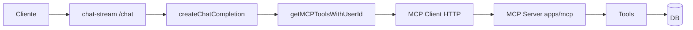

# IA com MCP no Polotrip

## 1. Visão geral

A IA com MCP (Model Context Protocol) no Polotrip permite que usuários consultem e naveguem álbuns de fotos de viagem via chat. O assistente usa ferramentas MCP para buscar álbums, fotos por data, local, estatísticas de viagem, etc. Os resultados são exibidos visualmente (cards, grids de fotos) no frontend.

## 2. Arquitetura

Fluxo: Cliente → rota `POST /chat` (chat-stream) → `createChatCompletion` → `getMCPToolsWithUserId` (mcp-client) → cliente MCP HTTP → servidor MCP (`apps/mcp`) → tools → banco de dados.

## 3. MCP Server (`apps/mcp`)

### Transport Streamable HTTP (stateful)

- O transport Streamable HTTP é **stateful por instância do servidor**. Crie **um único** transport e conecte-o **uma vez**; delegue cada requisição HTTP via `handleRequest()`.
- `sessionIdGenerator: () => crypto.randomUUID()`: modo stateful (o servidor gera o session id). Para stateless, use `sessionIdGenerator: undefined`.

### Endpoint `/mcp`

- Único endpoint; aceita GET, POST e DELETE.
- CORS: `Access-Control-Allow-Origin: *`, `Access-Control-Allow-Methods: GET, POST, DELETE, OPTIONS`, `Access-Control-Allow-Headers: Content-Type, Authorization, Mcp-Session-Id`.
- OPTIONS: responde 200 e encerra.
- `reply.hijack()` para o transport escrever a resposta diretamente.
- O Fastify pode parsear JSON; quando houver body parseado, repasse-o em `handleRequest`. Para GET/DELETE o body é `undefined`.

### Registro de tools

- Handler genérico: try/catch, mapeia `content` para `{ type: "text", text }`, repassa `isError` quando existir; em exceção retorna `{ content: [{ type: "text", text: JSON.stringify({ error }) }], isError: true }`.

### Ferramentas disponíveis

| Tool | Responsabilidade |
|------|------------------|
| `getUserAlbums` | Lista álbums do usuário (capas, datas, contagem de fotos). |
| `getAlbumByName` | Busca álbums por nome/título (match parcial, case-insensitive). |
| `getAlbumPhotos` | Fotos de um álbum (requer albumId). |
| `getPhotosByDate` | Fotos de um álbum em uma data (YYYY-MM-DD). |
| `getPhotosByLocation` | Fotos por termo em `locationName` ou `description` em um álbum específico (requer albumId). |
| `searchPhotosAcrossAlbums` | Busca fotos em **todos os álbums** do usuário por termo em `locationName` ou `description` (NÃO requer albumId). Use quando o usuário não menciona um álbum específico. |
| `getTripStats` | Estatísticas do álbum (total de fotos, locais, intervalo de datas). |

## 4. MCP Client (`apps/server`)

### getMCPClient (singleton)

- Uma única instância; `MCP_SERVER_URL` (default `http://localhost:3334`). Em falha de conexão o singleton é limpo e o erro é relançado. Mensagem específica quando a mensagem inclui "Connection closed" ou "MCP error" (verificar MCP_SECRET e DATABASE_URL).

### getMCPToolsWithUserId

- Obtém as tools do cliente MCP e envolve o `execute` de cada uma para: (1) injetar `userId` em `args`; (2) repassar o `context` (toolCallId, messages) se fornecido; caso contrário usar contexto mínimo: `{ toolCallId: "", messages: [] }`; (3) chamar `parseMcpToolResult` no retorno.

### parseMcpToolResult (mcp-tool-result-parser)

- O MCP devolve JSON em string em `content[0].text` ou em `result.text`. O frontend precisa de **objetos**. O `@ai-sdk/mcp` pode já fazer parte do parse; garantimos objeto via `parseMcpToolResult`.
- Formatos tratados: objeto com `text` → `JSON.parse(result.text)` (ou original se falhar); objeto com `content[0].text` → `JSON.parse(content[0].text)` (ou original); objeto já “parsed” (ex.: array de álbums) → retorno como está; string → `JSON.parse` (ou original).

### closeMCPClient

- Chamado apenas em erros de conexão ("Connection closed", "MCP error") para permitir retry nas próximas requisições. O client é mantido vivo entre requisições e fechado no shutdown do processo ou quando ocorre esse tipo de erro.

## 5. create-chat-completion

- **System prompt:** `CHAT_SYSTEM_PROMPT` em `app/lib/prompts/chat-system-prompt.ts`.
- **streamText:** modelo `gpt-4o-mini` (OpenAI), `stepCountIs(5)` para permitir até 5 passos e multi-step tool calling (modelo chama tools e depois gera texto).
- **onFinish:** não é usado para fechar o client; o client é mantido para reuse. O fechamento ocorre no shutdown do processo ou em erros de conexão.
- **onError:** fecha o client MCP apenas quando a mensagem de erro contém "Connection closed" ou "MCP error", para permitir retry.
- **Retorno:** o tipo de retorno do `streamText` do AI SDK é complexo e não pode ser nomeado explicitamente (limitação do TypeScript). Usa-se uma função wrapper com tipo explícito e export com cast `as typeof createChatCompletionInternal`.

## 6. Rota de Chat Stream (`POST /chat`)

### UIMessage

- **Formato legado:** `content` (string). **Formato novo:** `parts` (array de partes; para texto, `type === "text"` e `text`). `extractTextFromUIMessage` prioriza `content` se existir; senão extrai e concatena as partes com `type === "text"`.

### convertUiMessagesToApiFormat

- Por mensagem: extrair texto, sanitizar (trim, remover `\0`), descartar vazias, validar tamanho ≤ 4000 (lança `BadRequestError`), manter só `user` e `assistant`. Retorna `{ role, content }[]`.

### validateChatRequest

- Exige ao menos uma mensagem de usuário; aplica `detectPromptInjection` na **última** mensagem de usuário; limite total da conversa ≤ 50_000 caracteres. Lança `BadRequestError` com as mensagens atuais.

### Stream e transporte

- `toUIMessageStreamResponse()` para uso com `useChat` e DefaultChatTransport.
- O body da resposta é um Web Stream; converte-se para `Readable` (Node) com `Readable.fromWeb(response.body)` para o Fastify. Erros do stream são logados em `nodeStream.on("error")`.

### Detecção de prompt injection

- Objetivo: bloquear tentativas de manipulação (ex.: "ignore previous instructions", "you are now", "pretend to be"). A verificação é feita na **última mensagem do usuário** antes de chamar o modelo.
- Padrões (regex): `ignore (previous|prior|all|above) instructions?`, `forget (everything|all|previous|prior)`, `you are now `, `new instructions?:`, `system\s*:\s*`, `\[system\]`, `pretend (to be|you are)`, `roleplay as`, `act as (a )?(?!travel|photo|album)`, `your new role`, `disregard `, `override `, `<\|im_start\|>`, `<\|im_end\|>`, `\[INST\]`, `\[\/INST\]`.

## 7. Ferramentas MCP – detalhes

### searchPhotosAcrossAlbums

- Busca fotos em **todos os álbums** do usuário sem precisar de `albumId`.
- Busca em **`locationName`** e **`description`**. O campo `description` costuma ser mais rico (pessoas, situações, momentos) e pode conter o contexto mesmo quando `locationName` está vazio.
- Match case-insensitive e parcial.
- **Use quando:** o usuário pede fotos mas não menciona um álbum específico (ex.: "me mostre fotos do aniversário da Vivi", "fotos da praia").
- **Não use quando:** o usuário menciona um álbum específico (use `getPhotosByLocation` com `albumId` nesse caso).

### getPhotosByLocation

- Busca fotos em um álbum específico (requer `albumId`).
- Busca em **`locationName`** e **`description`**. O campo `description` costuma ser mais rico (pessoas, situações, momentos) e pode conter o contexto mesmo quando `locationName` está vazio.
- Match case-insensitive e parcial.
- **Use quando:** você já tem o `albumId` (do contexto da conversa ou de uma ferramenta anterior como `getAlbumByName`).

### getPhotosByDate

- O parâmetro `date` deve estar em formato ISO **YYYY-MM-DD**.

## 8. Otimizações de Performance

### Índices GIN com pg_trgm

- Os campos `description` e `locationName` da tabela `photos` possuem índices GIN com a extensão `pg_trgm` (trigram).
- Esses índices otimizam buscas parciais com `ilike` e wildcards (`%termo%`), tornando as buscas muito mais rápidas mesmo com milhões de fotos.
- A extensão `pg_trgm` deve estar habilitada no banco de dados PostgreSQL.

## 9. Decisões e notas

- **Formato de resultado MCP:** strings JSON em `content[0].text` ou `result.text` são convertidas em objetos para o frontend.
- **Quando fechar o client MCP:** apenas em erros de conexão ("Connection closed", "MCP error"); em `onFinish` o client não é fechado (reuse).
- **UIMessage:** `content` é fallback legado; `parts` é o formato novo. A extração de texto cobre ambos.
- **stepCountIs(5):** permite até 5 passos de tool calling + geração de texto em uma única resposta.
- **Conversão Web Stream → Node:** `Readable.fromWeb`; o `biome-ignore` para `noExplicitAny` na conversão do `ReadableStream` é mantido.
- **Busca por descrição:** quando o usuário não menciona um álbum específico, use `searchPhotosAcrossAlbums` em vez de perguntar qual álbum. Isso melhora a experiência do usuário.
